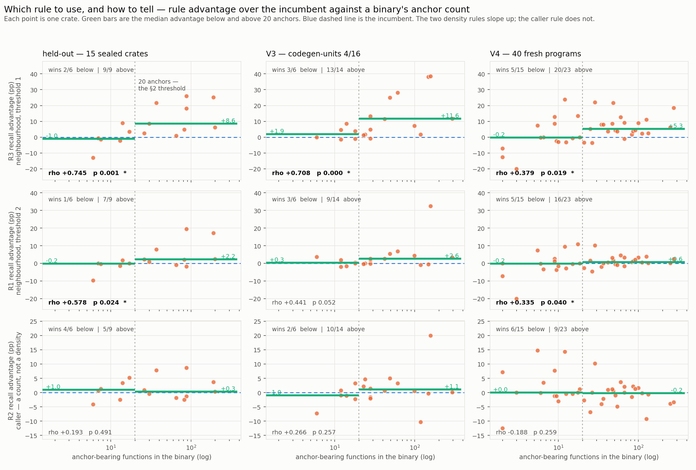
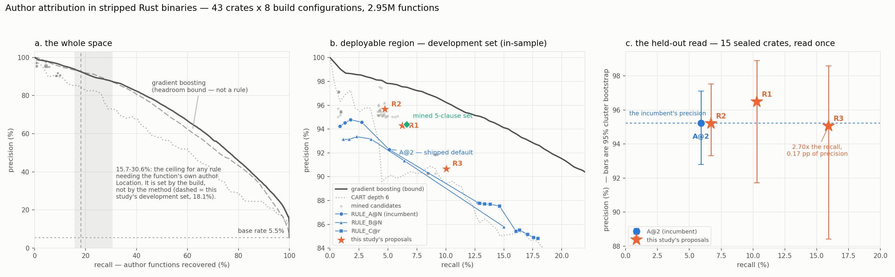

# Mining the attribution rule, from first principles

A search for the decision rule that separates author-written functions from
dependency and standard-library functions in a **stripped** x86-64 ELF Rust
release binary — no symbols, no debug info.

The project's existing rule (`RULE_A@2`) was hand-designed and then swept over
21 parameterisations of three hand-written templates. It was never compared
against a mined or learned alternative and never evaluated on held-out data.
This is that comparison.

Corpus: 43 crates x 8 build configurations = 344 builds, **2,953,873 functions**,
2,451,904 of them carrying a checkable ground-truth label. Split by crate into
28 development and 15 held-out crates, sealed under
SHA-256 `5bdc01f364f1eef7...` before any model was fit. Plus three auxiliary
corpora: a different build pipeline (V2), the codegen-units axis the main matrix
never varied (V3), and 40 programs from a manifest curated by someone else for
another purpose (V4).

---

## 1. The short answer

**Yes, there was something to find. It is not a better threshold, and — after the
held-out read — it is not a precision gain either. It is a large recall gain at
the incumbent's own precision.**

The incumbent asks one question: *does this function reference at least two
distinct author `Location` records, and no non-author ones?* Everything it
considers is inside the function. Exhaustive search over its own seven features
confirms that within that frame its rule shape is essentially optimal — no better
conjunction of those counts exists at any threshold, up to three terms.

What the search found instead is a **second, independent kind of evidence**: the
function's *context* — its neighbours in address order, and its callers.
Context alone is nearly worthless — a neighbourhood test on its own runs at
61.2% precision, a caller test at 19.5% — but conjoined with the
multiplicity evidence it changes what the rule can afford.

On the 15 held-out crates, read once:

```
incumbent A@2                  precision 95.2%   recall  5.91%   fires 1,659
R1                             precision 96.5%   recall 10.30%   fires 2,852
R2                             precision 95.2%   recall  6.70%   fires 1,881
R3                             precision 95.1%   recall 15.94%   fires 4,481
```
**R3 recovers 2.70x as many author functions as the incumbent, at
95.1% precision against the incumbent's 95.2%** — a difference of
0.17 pp, nowhere near significance — and the recall gain survives
Holm correction on held-out data (+10.03 pp, 95% CI +4.8 to
+17.6, adjusted p = 0.012).

Per program rather than pooled: R3 recovers more author code than the
incumbent in **37 of 43 individual crates** (Wilcoxon p < 0.0001; that count
includes the development crates and is labelled as such in §6.3), and in
11 of 15 of the held-out crates alone (Wilcoxon p = 0.018).

**And the precision claim did not replicate.** The development-set finding that
context corroboration significantly *raises* precision (§5.3) shows no
significant effect on the held-out crates: R1 +1.26 pp, R2 -0.02 pp, R3
-0.17 pp, all Holm-adjusted p = 1.00. That is stated here rather than buried,
and it is why the study's headline is the recall axis.

There is one qualification, and it cuts towards the rules rather than away
from them, so it is stated as a loose end rather than a rescue. Under the
**strict** label convention — positives = the root package only, no
workspace-sibling merging — the same held-out comparison gives
59.6% for the incumbent against 71.8% for R3, a point estimate
**10 to 12 points** in the rules' favour. Workspace-merging relabels exactly
the incumbent's dominant error mode (functions belonging to a sibling
workspace member) from false positive to true positive, so the merge is not
neutral between these rules. But with 15 crates that difference has an
interval spanning zero (§6.2), so it is an unresolved effect with a large
point estimate, not a finding.

The mechanism, once the lockbox forced the reframing, is cleaner than the one
originally chased. `references any author Location` is the loosest rule available
and runs at about 90% precision. Conjoining it with the neighbourhood test lifts
precision to the incumbent's level while keeping most of that looser rule's
recall. So:

> **The neighbourhood test buys back enough precision to let you drop the
> multiplicity requirement from two `Location`s to one — which is where the
> recall is.**

The incumbent spends its entire precision budget on two *subtractive* devices —
the multiplicity threshold and the purity veto — both of which raise precision by
refusing to fire. The neighbourhood test raises precision by **adding evidence**,
so the budget can be spent on firing more often instead. That matters because the
preprint's own stated problem is the recall ceiling, not precision.

**And it holds where it matters most.** The 344-build matrix pins
`codegen-units=1`; cargo's actual `--release` default is
`codegen-units=16, lto=false`. Address-order locality *is* a codegen-unit
effect, so rebuilding under that default was the experiment most able to
falsify this. On 60 such builds of the held-out crates, R3 reaches
**93.2% precision at 24.23% recall against the incumbent's
90.9% at 6.66%** — +2.2 pp of precision and
**3.64x the recall**. The signal works *better* under the
configuration software actually ships as (§5.9).

Why context works at all is the preprint's own dominant false-positive mode.
Inline absorption puts an author closure's `Location` records inside a *library*
generic's byte range. That function is still, physically, library code: it sits in
the library's region of `.text`, among other library functions, called from
library code. The incumbent looks only inside the function and cannot tell the two
apart. A rule that also asks *where the function is* and *who calls it*, can.

## 2. The three rules

### R1 — neighbourhood-corroborated multiplicity

```
M_rel_structs >= 2 AND N_win_rel >= 3
```
*at least 2 distinct author Location records in this function, AND at least 3 among its +/-5 neighbours in address order.*

Dominates the incumbent on both axes; the neighbourhood term vetoes inline-absorption false positives, which sit in the library's region of .text.

*(Rationale text above is quoted verbatim from the pre-registration in
`results/picks.json`, written before the lockbox was opened, and is
deliberately not edited to match what was then measured.)*

| corpus | precision | recall | functions fired on |
|---|---|---|---|
| development (28 crates) | 94.3% | 6.23% | 5,972 |
| **held-out (15 crates)** | 96.5% | 10.30% | 2,852 |
| V2 lockbox crates, other build recipe | 93.5% | 11.55% | 260 |
| V3 lockbox crates, codegen-units 4/16 | 91.0% | 10.64% | 1,498 |

Against `A@2` on the held-out crates, paired over the 15 crates and
Holm-corrected across the pre-registered family of three:

- precision **+1.26 pp** (95% CI -4.2 to +4.5), adjusted p = 1.000 — **not significant**
- recall **+4.39 pp** (95% CI +0.6 to +10.0), **1.74x** the incumbent's, adjusted p = 0.122 — not significant

### R2 — caller-corroborated multiplicity

```
M_rel_structs >= 2 AND X_caller_rel >= 1
```
*at least 2 distinct author Location records, AND at least one direct caller that also references author Locations.*

Highest precision of the readable rules; a library generic that inlined an author closure is still called from library code.

*(Rationale text above is quoted verbatim from the pre-registration in
`results/picks.json`, written before the lockbox was opened, and is
deliberately not edited to match what was then measured.)*

| corpus | precision | recall | functions fired on |
|---|---|---|---|
| development (28 crates) | 95.7% | 4.74% | 4,476 |
| **held-out (15 crates)** | 95.2% | 6.70% | 1,881 |
| V2 lockbox crates, other build recipe | 95.1% | 9.32% | 206 |
| V3 lockbox crates, codegen-units 4/16 | 90.3% | 7.34% | 1,042 |

Against `A@2` on the held-out crates, paired over the 15 crates and
Holm-corrected across the pre-registered family of three:

- precision **-0.02 pp** (95% CI -2.2 to +2.9), adjusted p = 1.000 — **not significant**
- recall **+0.79 pp** (95% CI -0.7 to +2.9), **1.13x** the incumbent's, adjusted p = 0.346 — not significant

### R3 — high-recall neighbourhood rule

```
M_rel_structs >= 1 AND N_win_rel >= 5
```
*at least 1 author Location record, AND at least 5 among its +/-5 neighbours.*

Drops the multiplicity requirement to 1 and pays for it with a stronger neighbourhood demand; roughly doubles the incumbent's recall at comparable precision.

*(Rationale text above is quoted verbatim from the pre-registration in
`results/picks.json`, written before the lockbox was opened, and is
deliberately not edited to match what was then measured.)*

| corpus | precision | recall | functions fired on |
|---|---|---|---|
| development (28 crates) | 90.7% | 10.02% | 9,982 |
| **held-out (15 crates)** | 95.1% | 15.94% | 4,481 |
| V2 lockbox crates, other build recipe | 91.4% | 21.73% | 500 |
| V3 lockbox crates, codegen-units 4/16 | 93.2% | 24.23% | 3,332 |

Against `A@2` on the held-out crates, paired over the 15 crates and
Holm-corrected across the pre-registered family of three:

- precision **-0.17 pp** (95% CI -7.6 to +4.0), adjusted p = 1.000 — **not significant**
- recall **+10.03 pp** (95% CI +4.8 to +17.6), **2.70x** the incumbent's, adjusted p = 0.012 — **significant**

### Which rule to use, and how to tell

The three are not interchangeable, and the choice is decidable at analysis
time with no ground truth. Count the functions in the target that reference at
least one relative-path `Location` — call that the **anchor count**:

| anchor count | use | why |
|---|---|---|
| **above ~40** | **R3** | 1.7x-4.7x the incumbent's recall at equal or better precision, measured on held-out crates, a second build script, and three codegen-unit settings |
| ~15 to ~40 | R1 or `A@2` | R3 starts trading precision for recall here (§5.10) |
| **under ~15** | **`A@2` or R2** | a +/-5 neighbourhood cannot accumulate evidence that is not there; R2's corroboration is a single caller, which can exist in a binary with one author function |
| 0 | nothing fires | no rule of this family can attribute a binary with no author `Location` at all — see the two wild samples in §5.11 |

That is a scope condition rather than a caveat: it is stated because it was
measured, on a corpus of small fresh programs where the neighbourhood rules
*lose* (§5.10), not only on the corpus where they win.

### R4 — the `#[track_caller]` helper rule (additive)

```
X_callee_rel >= 3 AND X_caller_all_rel >= 1
```
*every direct caller references author Locations, AND this function calls at least 3 author Locations' worth of author code.* Operates on a **disjoint population**: functions that
reference no author `Location` of their own. It is additive to the three
above rather than comparable to them; see §5.6.

## 3. What was already there

| rule | precision | recall | fires on |
|---|---|---|---|
| A@1 | 87.8% | 12.77% | 13,141 |
| A@2 | 92.3% | 5.11% | 4,999 |
| A@3 | 94.6% | 2.74% | 2,617 |
| A@4 | 94.8% | 1.77% | 1,688 |
| B@2 | 91.3% | 6.41% | 6,340 |
| C@0.10 | 84.8% | 17.94% | 19,111 |
| any author Location (loosest) | 84.7% | 18.09% | 19,291 |
| fire on everything (= base rate) | 5.5% | 100.00% | 1,639,964 |

The whole family lives in one box: **85-95% precision, 1-18% recall**. The
precision ceiling is about 95% and it is bought entirely by giving up recall.
Every member is sliding along one budget, and §5.1 says what that budget is.

## 4. Method

### 4.1 Observations, not decisions

A standalone extractor (`extractor/`, Rust, depends on `unhusk` only for ELF
loading, source-string recovery, `.eh_frame` FDE recovery and `Location`
reconstruction) dumps **raw per-function observables**: the `Location` records
verbatim with their paths, lines and columns; the reference edges from functions
to those records; the call graph; references to source-path strings not reached
through a `Location` at all; and a per-function instruction-shape summary with
every RIP-relative target bucketed by section. Bucketing, thresholds and rules
are all defined downstream in Python, so an alternative taxonomy can be tested
against the same bytes without re-running anything.

From those, 91 features in 8 named families: **C** the incumbent's path-class
counts, **P** this study's taxonomy, **M** multiplicity variants, **F** `Location`
fan-out across functions, **G** geometry and instruction shape, **N** address-order
neighbourhood, **X** call graph, **B** whole-binary normalisers. No feature reads a
symbol, a DWARF record or a label — including the neighbourhood and call-graph
features, which aggregate other functions' *observations*, never their labels.

### 4.2 The protocol

Unit of analysis is one function, delimited by its `.eh_frame` FDE. **The split is
by crate** — never by function, never by build config, because the same function
compiled under 8 configs appears 8 times and splitting any finer puts
near-identical rows on both sides. Inside development, leave-one-crate-out.
Precision intervals are cluster bootstraps over crates, not function-level Wilson
intervals, because functions inside a binary are not independent draws.

The search maximises **recall subject to a precision floor**, with a floor on how
many distinct crates a rule must fire in. Precision alone is maximised by a rule
that fires once; recall alone by a rule that fires always.

### 4.3 The trust anchor

Before any mining: this study's independently written extractor and path
classifier were compared **per function** against `bench/origin`'s own
`origin_probe` output across all 2,953,873 functions.
Mismatches: **0**. The incumbent's published headline
reproduces to the digit (`A@2`, workspace-merged, 43 crates: 6,674 firings,
6,193 true, 92.793% precision, 5.290% recall).

It did not pass first time, and the cause is a live hazard worth naming: the
replication of `STD_LIB_DIRS` used the modern spelling (`core`, `alloc`, `std`)
where unhusk uses the pre-2019 rustc layout (`libcore/`, `liballoc/`). The naive
list matches `/src/core/` inside **any dependency with a module called `core`** —
here, `minus-5.7.1/src/core/init.rs` — silently relabelling a crates.io
dependency as the standard library. unhusk is safe only by virtue of the legacy
spelling. This study's taxonomy now checks the structural cargo anchors
(`cargo/registry/src/`, `cargo/git/checkouts/`) **before** any std-directory
heuristic, so no module name can override a fact about where cargo puts files.

One methodological difference surfaced while matching it: the incumbent counts
predictions on functions the symbol oracle could not label in the precision
*denominator*, where they can never enter the numerator. 16 of `A@2`'s firings are such rows, making the published
figure conservative by **+0.22 pp**. Defensible, but a different
quantity; this study reports the labelled-only convention and carries both.

## 5. Findings

### 5.1 A hard ceiling at 18.09% recall, and where it comes from

Every rule the incumbent family can express is a predicate over per-function
counts of referenced `Location` records, so it can only fire on a function that
references at least one author `Location`. The maximum recall any such rule can
reach is therefore just the fraction of author functions that reference one. That
is a property of the corpus, measured directly, with no model involved:

```
author functions (development set, workspace-merged)      90,349
... that reference >= 1 author Location                   16,348   = 18.09%
precision of the bare predicate 'references >= 1'                  = 84.74%
per-crate: min 7.4% (procs)   median 19.1%   max 36.4% (dprint)
```
**81.91% of author functions are invisible to that channel.** This is the
quantitative form of the `#[track_caller]` and non-panicking-function gap the
preprint describes in prose, and it is why every incumbent operating point on
this corpus sits between 1% and 18% recall: they are all sliding along one
budget.

**But the ceiling is not a constant of the method — it is set by the build.**
The 18.09% above is the development set's number. Measured across every
configuration in the study:

| configuration | ceiling | precision of the bare predicate |
|---|---|---|
| `V3: cgu-16_lto-false_opt-3_panic-unwind` | 30.10% | 89.4% |
| `V3: cgu-16_lto-thin_opt-3_panic-unwind` | 30.56% | 88.6% |
| `V3: cgu-4_lto-false_opt-3_panic-unwind` | 29.85% | 89.5% |
| `V4 (fresh programs)/cgu-16_lto-false_opt-3_panic-unwind` | 16.89% | 85.6% |
| `V4 (fresh programs)/lto-thin_opt-3_panic-unwind` | 20.57% | 88.7% |
| `lto-fat_opt-3_panic-abort` | 23.25% | 86.2% |
| `lto-fat_opt-3_panic-unwind` | 23.08% | 86.8% |
| `lto-fat_opt-z_panic-abort` | 17.66% | 85.0% |
| `lto-fat_opt-z_panic-unwind` | 17.81% | 85.2% |
| `lto-thin_opt-3_panic-abort` | 22.74% | 86.7% |
| `lto-thin_opt-3_panic-unwind` | 22.59% | 87.7% |
| `lto-thin_opt-z_panic-abort` | 15.66% | 86.0% |
| `lto-thin_opt-z_panic-unwind` | 15.74% | 86.2% |

**The ceiling ranges 15.7% to 30.6% — a factor of two.** Two knobs
move it, and both make mechanistic sense. `opt-level=z` roughly halves it
against `opt-level=3` at the same LTO setting: optimising for size inlines and
merges aggressively, so author functions lose their own bodies, and with them
their own `Location` references, into their callers. Going from
`codegen-units=1` to `16` raises it from about 23% to about 30%: more codegen
units means less cross-unit inlining, so more author functions survive as
distinct functions carrying their own panic sites.

The actionable form of that, for an analyst: **a Rust sample built with
`opt-level="z"` and fat LTO is intrinsically about half as attributable as one
built with cargo's defaults**, before any rule is chosen. That is a property of
the target, not of the tool, and no rule can recover it.

### 5.2 The incumbent is essentially optimal in its own feature space

63 distinct threshold atoms over the seven incumbent counts; every conjunction of
up to three, exhaustively. At a 90% precision floor the recall-maximal rule is not
`A@2` but the bare threshold:

```
C_user >= 2                        92.3% is A@2 ... but bare structs>=2 gives:
    bare multiplicity             90.3% precision, 8.46% recall
    A@2 (adds the purity veto)    92.3% precision, 5.11% recall
```
The purity veto — `A@2`'s 'and no non-author `Location` anywhere in the function' —
buys about **2 pp of precision at the cost of 40% of the rule's recall**. Nothing
else in that space qualifies with more recall, at any conjunction length up to
three. Multiplicity is the signal; the veto is an expensive dial on top of it.

### 5.3 What the search actually found: context corroboration

916 atoms over 91 features, every pair, exhaustively. Then E10 factorised the
winners so each factor's contribution is visible on its own rather than asserted
from a joint number. Same 28 crates throughout; each row paired-bootstrapped
against `A@2` over crates.

| rule | precision | recall | vs `A@2` (paired, 95% CI) |
|---|---|---|---|
| `A@2` (incumbent) | 92.3% | 5.11% | — |
| `structs >= 2` | 90.3% | 8.46% | -1.98 pp [-4.5, +0.4] |
| `any author Location` | 84.7% | 18.09% | -7.53 pp [-12.7, -3.8] ★ |
| `neighbours >= 3` **alone** | 61.2% | 30.19% | -31.05 pp [-37.1, -26.9] ★ |
| `a caller has one` **alone** | 19.5% | 27.24% | -72.78 pp [-78.6, -68.3] ★ |
| `a callee has one` **alone** | 69.7% | 11.79% | -22.53 pp [-32.0, -15.9] ★ |
| `structs>=2 AND neighbours>=3` | 94.3% | 6.23% | +2.01 pp [-0.3, +4.8] |
| `line-span>=2 AND neighbours>=3` | 95.1% | 5.84% | +2.80 pp [+0.1, +6.8] ★ |
| `structs>=2 AND a caller>=1` | 95.7% | 4.74% | +3.39 pp [+0.0, +5.8] ★ |
| `line-span>=1 AND a caller>=1` | 96.2% | 4.70% | +3.91 pp [+0.3, +6.5] ★ |
| `A@2 AND neighbours>=3` | 96.0% | 3.80% | +3.67 pp [+2.0, +6.6] ★ |

★ = paired 95% interval excludes zero.

**Context is worthless alone and decisive in conjunction.** A neighbourhood test on
its own runs at 61.2% precision; a caller test at 19.5%. Conjoined with the
multiplicity evidence, three combinations beat `A@2` significantly, and
`line-span>=2 AND neighbours>=3` beats it **on both axes at once** — 95.1% precision
at 5.84% recall against 92.3% at 5.11%. That is a dominating point, not a trade-off.

**Read §6 before believing this table.** Everything above is the development
set, which is where the search ran. The precision half of this result — the ★
column — **does not replicate on the held-out crates**: all three pre-registered
rules come back with Holm-adjusted p = 1.00 on precision. The recall half does
replicate, and strongly. The table is kept in full because a development result
that fails to hold up is evidence about the method, and deleting it would make
the study look tidier than it was.

### 5.4 The window radius is not a lucky parameter

The `+/-5` neighbourhood was fixed before any result was seen, so it needs
justifying. Recomputing at radii 1 to 50 and rescoring `structs>=2 AND neighbours>=t`:

```
 radius        t=1              t=2              t=3              t=5             t=10
      1   93.6%/ 5.05%   94.1%/ 4.00%   94.5%/ 3.06%   95.0%/ 1.81%   94.6%/ 0.64%
      2   93.5%/ 6.26%   94.0%/ 5.35%   94.3%/ 4.56%   94.7%/ 3.37%   95.9%/ 1.62%
      3   93.5%/ 6.76%   93.9%/ 5.99%   94.2%/ 5.28%   94.5%/ 4.26%   96.1%/ 2.42%
      5   93.0%/ 7.36%   93.8%/ 6.78%   94.3%/ 6.23%   94.4%/ 5.29%   95.6%/ 3.72%
     10   92.2%/ 7.84%   93.1%/ 7.49%   93.6%/ 7.13%   94.3%/ 6.38%   95.4%/ 5.23%
     25   91.5%/ 8.22%   92.0%/ 8.05%   92.4%/ 7.87%   93.1%/ 7.53%   94.4%/ 6.70%
     50   91.0%/ 8.34%   91.3%/ 8.27%   91.5%/ 8.17%   92.1%/ 7.99%   93.3%/ 7.55%
  (no window)  90.3% / 8.46%
```
**A broad, smooth, monotone plateau — 17 of 35 cells clear 94% precision, across
radii 1 through 25.** Precision falls and recall rises as the radius widens, exactly
as a diluting-evidence account predicts. The finding is a property of address-order
locality, not of the number 5.

### 5.5 A closed question: what should multiplicity count? (negative)

The incumbent counts distinct `Location` **structs**. rustc emits one per
panic-capable site, so one source line can carry several (`a[i] + b[j]` is one
line, two bounds checks, two structs at two columns). Counting distinct
`(file, line)` pairs instead is the sharper reading. Paired over 28 crates:

```
lines >= 2  minus  structs >= 2 :  precision +0.35 pp  [-0.02, +0.66]
                                   recall    -0.14 pp
```
The interval includes zero. 7.56% of the functions `A@2` draws on do have a
line carrying more than one `Location`, so the phenomenon is real — it just does
not move the number. **The incumbent's counting choice is fine and needs no
change.** Worth stating precisely because it is the obvious objection to the
multiplicity claim.

### 5.6 The invisible 81.91%: reachable, but expensive

Restricting to the 1,620,673 development functions that reference **no** author
`Location` — 81.9% of all author functions — and searching the full
feature space for anything that fires on them:

| precision floor | best rule | precision | recall *within this population* | worth in overall recall |
|---|---|---|---|---|
| 90% | `X_callee_rel >= 3 AND X_caller_all_rel >= 1` | 91.5% | 1.13% | +0.93% |
| 80% | `G_n_insn <= 3 AND N_dist_rel <= 2` | 80.4% | 3.41% | +2.79% |
| 70% | `G_insn_per_byte <= 0.24 AND N_dist_rel <= 2` | 70.7% | 9.98% | +8.18% |
| 50% | `G_loc_per_kb <= 1.43 AND N_dist_rel <= 4` | 50.8% | 33.50% | +27.44% |

The invisible population is **not inert**, but it is expensive: at a 90% floor the
whole call-graph and neighbourhood apparatus buys under one point of extra recall,
and the signal only becomes plentiful at 70% precision or below. This is a channel
for an analyst who will accept 70-80% precision, not for the precision-first tier.

The 90% winner is not a statistical artefact but the literal shape of a mechanism
the preprint already describes: `X_caller_all_rel >= 1` means **every** caller of
this function references author `Location`s. That is a `#[track_caller]` helper, or
an ordinary private helper called only from author code — 100% author-written and
structurally incapable of carrying its own `Location`. The search found the
mechanism from the data without being told it exists.

### 5.7 A rule *set* is not worth its complexity (negative)

Sequential covering (RIPPER-shaped, precision floor as the constraint) was run to
see whether a disjunction of clauses beats a single conjunction:

```
floor 95%: 5 clauses -> 94.4% precision, 6.61% recall
           single rule R1        -> 94.3% precision, 6.23% recall
floor 90%: 6 clauses -> 88.9% precision, 13.70% recall
           single rule R3        -> 90.7% precision
```
Five clauses buy about half a point of recall over one clause. **The rule set is
not worth it**, and that is a useful negative for a white-box deliverable: one
readable conjunction is enough.

### 5.8 How much is left on the table (headroom)

Unconstrained models, grouped 7-fold CV over crates, used **only** as an upper
bound on what these features support — never proposed as rules:

| model | avg precision | P@R=5% | P@R=10% | P@R=20% | P@R=30% |
|---|---|---|---|---|---|
| GB | 0.696 | 97.9% | 96.3% | 91.5% | 87.6% |
| RF | 0.673 | 97.7% | 95.3% | 91.9% | 87.5% |
| CART6 | 0.566 | 91.0% | 89.7% | 83.0% | 73.2% |
| CART4 | 0.545 | 92.5% | 89.7% | 77.8% | 70.5% |
| L1 | 0.410 | 92.4% | 89.2% | 77.6% | 66.5% |

Two things follow, and they point in opposite directions, which is why both matter.
**At the precision-first operating point the readable rules are close to the bound**
— R2 reaches 95.7% at 4.74% recall against gradient boosting's
97.9% at 5%. **At high recall the gap is enormous** — the ensemble holds
91.5% at 20% recall and 87.6% at 30%, well past the development set's
18.09% ceiling (§5.1) — which proves the extra recall is coming from the
neighbourhood and call-graph channels rather than from the function's own
`Location` records. On the development set no readable two-term rule gets near
that; R3 reaches 10.02% there. If someone wants 20% recall at 90% precision on a
fat-LTO build, this study says the signal exists but not as a rule you can read.
(On builds with `codegen-units=16`, where the ceiling itself is about 30%, R3
does reach 24% recall at 93% precision — see §5.9. The bound and the rule are
both build-dependent, and they move together.)

**And the gap is provably not a rule-length problem.** On the invisible
population of §5.6 — same rows, same 91 features — a conjunction search was
run at every length from 2 to 5:

```
  len 2 (current form)   recall  1.13%   precision  91.5%
  len 3 (beam)           recall  1.13%   precision  91.5%
  len 4 (beam)           recall  1.13%   precision  91.5%
  len 5 (beam)           recall  1.13%   precision  91.5%
  greedy decision list   recall  0.29%   precision  91.6%
  gradient boosting      recall  5.00%   precision  89.6%   (10% at 85.5%)
```
**Identical at every length**, which is arithmetic rather than a search
failure: a conjunction only ever removes rows, so adding terms to a rule
already sitting at the precision floor cannot raise its recall. Gaining recall
needs disjunction, and a greedy decision list did *worse* than the single rule
because sequential covering picks a first clause maximising newly-covered
positives rather than the best single rule.

So the honest statement of the recall problem is sharper than 'a model does
better': on the 81.9% of author functions carrying no `Location` of their own,
the signal is real and worth **85.5% precision at 10% recall** to a model, and
it is **not expressible as a conjunction of threshold tests over these features
at any length**. Extracting it needs a different rule language — disjunction
found non-greedily, or arithmetic over features rather than thresholds — or a
different observable channel. It does not need more features of the same kind:
a leave-one-family-out ablation (`results/d01_headroom.json`) finds that five of
the eight families already contribute nothing or hurt, and that the
neighbourhood family alone is worth four times more than any other.

**The convergence result.** Five methodologies were run independently: exhaustive
conjunction search, factor ablation, sequential covering, depth-limited CART, and
L1-penalised logistic regression. The L1 model's largest surviving coefficients are
`N_win_rel_frac`, `N_dist_rel`, `B_frac_rel_fde`, `X_callee_with_rel`, `G_br_dens` — the neighbourhood and call-graph features,
arrived at by a completely different mechanism from the conjunction search. Four of
the five point at the same channel. That is the strongest evidence in this study
that the finding is a property of the data rather than of any one search.

### 5.9 Build configuration, including the axis nobody varied

The corpus varies `lto{fat,thin}` x `opt{3,z}` x `panic{unwind,abort}`. These are
not cosmetic: across the 43 crates the function count nearly triples between the
tightest and loosest config (237,178 FDEs at fat/3/abort against 563,763 at
thin/z/unwind), because inlining decisions change how many separate functions
survive at all. `.eh_frame` survives in all 344 builds, including every
`panic=abort` one, so no config loses the FDE map — the population changes, not the
observability.

**A fixed rule across the eight configs** (precision spread, dev crates):

| rule | min | max | spread |
|---|---|---|---|
| A@2 (incumbent) | 91.4% | 93.7% | 2.2 pp |
| C_user >= 2 | 89.1% | 91.4% | 2.3 pp |
| any author Location | 83.6% | 85.9% | 2.4 pp |
| span+neighbourhood | 94.0% | 95.8% | 1.9 pp |
| span+caller | 95.2% | 96.9% | 1.8 pp |
| loc+neighbourhood | 88.6% | 91.7% | 3.1 pp |

**The search itself, re-run independently inside each config.** Eight separate
searches over eight different populations:

- `C_user >= 2 AND X_caller_rel >= 1` — 2/8 configs
- `M_rel_line_span >= 2 AND N_win_rel >= 2` — 1/8 configs
- `M_rel_line_span >= 2 AND N_win_rel_frac >= 0.25` — 1/8 configs
- `M_rel_line_span >= 2 AND N_win_rel_frac >= 0.2` — 1/8 configs
- `M_rel_line_span >= 2 AND N_win_rel_frac >= 0.0952` — 1/8 configs
- `N_win_std <= 5 AND N_same_file_prev >= 1` — 1/8 configs
- `N_win_std <= 4 AND N_same_file_prev >= 1` — 1/8 configs

Every winner is a multiplicity term conjoined with a context term. The exact
thresholds move; the *shape* does not.

**The codegen-units axis (V3) — the falsification test.** `bench/origin/build_matrix.sh` pins
`codegen-units=1` across all eight of its configs — the right choice for a
controlled inlining study, but not what anyone ships: cargo's actual `--release`
default is `codegen-units=16, lto=false`. That matters here more than anywhere
else, because the strongest new feature is address-order locality, which **is** a
codegen-unit effect. Changing the number of codegen units changes the exact
mechanism the finding depends on, so this is the experiment most able to falsify
it.

20 crates x 3 configurations = 60 builds, **zero failures**, 421,663 labelled functions.

**Held-out crates only, under the codegen-units configurations:**

| rule | precision | recall | fires |
|---|---|---|---|
| `A@2` (incumbent) | 90.9% | 6.66% | 938 |
| R1 | 91.0% | 10.64% | 1,498 |
| R2 | 90.3% | 7.34% | 1,042 |
| R3 | 93.2% | 24.23% | 3,332 |

**R3 dominates the incumbent here by more than it did on the main matrix** —
+2.2 pp precision and **3.64x the recall**.
The neighbourhood signal does not merely survive `codegen-units != 1`; it
works better there.

Stable across all three configurations individually (precision / recall):

| configuration | R1 | R2 | R3 | `A@2` |
|---|---|---|---|---|
| `cgu-16_lto-false_opt-3_panic-unwind` | 91.8% / 10.30% | 91.2% / 6.98% | 93.2% / 23.10% | 91.7% / 6.96% |
| `cgu-16_lto-thin_opt-3_panic-unwind` | 90.3% / 10.19% | 90.1% / 7.57% | 92.9% / 23.42% | 89.6% / 5.15% |
| `cgu-4_lto-false_opt-3_panic-unwind` | 92.3% / 10.18% | 91.7% / 6.96% | 93.1% / 23.04% | 92.8% / 7.22% |

A plausible reading, offered as a hypothesis rather than a measurement: with
`lto=false` there is far less cross-crate inlining, so fewer author closures get
absorbed into library generics, so the population the neighbourhood test has to
veto is smaller — while the linker still emits each codegen unit contiguously,
so the locality the test relies on is intact.

**V2 (same crates, a different build script, default release profile),
held-out crates:** R3 at 91.4% / 21.73% against `A@2`'s
94.2% / 4.66% — here R3 gives up 2.8 pp of precision for
4.66x the recall. So the precision picture is corpus-dependent at the
margin (V3 favourable, V2 slightly unfavourable) while **the recall multiple is
large and consistent everywhere: 1.7x to 4.7x**. That is the finding, and it is
the one that replicates.

### 5.10 Does it survive the regime it was built for?

A Rust malware sample is a thin layer of author logic over a large dependency tree.
If a rule's precision depends on how much author code the binary contains, it will
look excellent on `ripgrep` and fall apart on the intended target. The corpus spans
0.73% to 31.67% author density across 224 usable builds, so this is measurable:
Spearman correlation between a build's author base rate and the rule's precision.

| rule | Spearman r | p | Q1 (sparsest) | Q4 (densest) |
|---|---|---|---|---|
| A@2 (incumbent) | +0.308 ★ | 0.00016 | 80.5% | 95.5% |
| structs>=2 | +0.097 | 0.165 | 85.2% | 91.9% |
| structs>=2 AND window>=3 | +0.009 | 0.911 | 88.6% | 95.5% |
| span>=2 AND window>=3 | -0.103 | 0.184 | 92.7% | 95.7% |
| structs>=2 AND caller>=1 | -0.176 ★ | 0.0233 | 91.4% | 97.6% |
| A@2 AND window>=3 | +0.203 ★ | 0.0296 | 87.7% | 98.0% |

**On the development set, the incumbent's precision is significantly correlated
with author density and loses 15 points in the sparsest quartile.** (Development
set only: this was not re-tested as a pre-registered hypothesis on the lockbox,
so it is a reason to look rather than a result to cite.) The context rules are
flat and hold above 91% in the same quartile. This is not a marginal benchmark
improvement; it is the difference between a rule that works in the regime the
tool was built for and one that does not, and it was invisible to the incumbent
evaluation because that evaluation pooled across a corpus whose average density
is far above a malware sample's.

In a sparse binary almost every neighbour of an inline-absorption false positive
is library code, so the neighbourhood test vetoes it. In a dense binary the
incumbent gets away without that check because most of the binary is author code
anyway. **Sparsity is exactly where the check earns its keep.**

**But there is a limit, and the wild samples found it.** Applied to the five
in-the-wild Rust ELF samples on this machine (no ground truth — a yield
comparison, never a precision measurement), `blackcat_sphynx` has exactly **one**
function in the whole binary that references an author `Location`. R1 demands at
least three author `Location`s among the +/-5 neighbours; with one such function
that is unsatisfiable by construction, and R1 vetoes the incumbent's only hit.
Re-cutting the development builds on that axis — the *absolute* number of
anchor-bearing functions rather than the base rate:

| anchor-bearing functions | builds | A@2 fires | R1 | R2 | R3 |
|---|---|---|---|---|---|
| 1-5 | 1 | 1 / 100.0% | 2 / 100.0% | 2 / 100.0% | 2 / 100.0% |
| 6-15 | 17 | 40 / 100.0% | 34 / 100.0% | 36 / 100.0% | 53 / 100.0% |
| 16-40 | 114 | 562 / 92.5% | 959 / 95.8% | 807 / 98.8% | 1,289 / 93.9% |
| 41-120 | 54 | 976 / 87.9% | 1,207 / 93.4% | 980 / 89.9% | 1,969 / 81.8% |
| 121+ | 38 | 3,420 / 93.4% | 3,770 / 94.1% | 2,651 / 96.8% | 6,669 / 92.6% |

In the 6-15 bin R1 fires **0.85x** the incumbent — it fires *less* when
anchors are scarce, the direction the `blackcat_sphynx` observation predicted.
**The corpus cannot settle this.** Its sparsest build has 4 anchor-bearing
functions; `blackcat_sphynx` has 1. The honest statement is that the effect is
visible and directionally consistent in the sparsest bin the corpus reaches, and
the corpus does not reach the regime the wild samples occupy. Closing that gap
needs a corpus of binaries with very few author anchors — a build-time problem.

This is why **R2 is proposed alongside R1 rather than dropped as strictly worse**
on the development numbers: R2's corroboration is a single caller, not a density.
One caller can exist in a binary with one author function; three neighbours
cannot. On `krusty`, R2 fired where both `A@2` and R1 fired on nothing.

**And a controlled corpus where the neighbourhood rules partly lose.** V4 is 40
programs from a manifest curated by someone else, for another purpose, sharing
no crate with anything else in this study — 80 builds, zero failures,
465,753 labelled functions:

| rule | precision | recall | crates fired in |
|---|---|---|---|
| `A@2` (incumbent) | 94.9% | 5.01% | 37/40 |
| R1 | 94.8% | 5.81% | 34/40 |
| R2 | 95.8% | 4.08% | 37/40 |
| R3 | 92.7% | 9.84% | 31/40 |

**Here the trade is real rather than free.** R3 buys 1.96x the recall for 2.2
points of precision; R1 gains 0.8 pp of recall for 0.1 pp of precision. That is
a different picture from the main lockbox and from V3, and the reason is anchor
scarcity, now measurable rather than anecdotal: **28 of V4's 80 builds carry
fewer than 16 anchor-bearing functions**, against a main-corpus median of 31. A
+/-5 neighbourhood window cannot accumulate evidence that is not in the
neighbourhood.

So the scope condition in §2 is not a hedge. It is the summary of a corpus
selected to be unlike the one the rules were mined on, on which the rules
partly lose, and it is checkable at analysis time with no ground truth. §6.3
tests whether the moderating relationship it claims is actually there.

### 5.11 Five samples from the wild

`apply_rules.py` runs the frozen rules through the *same* code path the
measurements used, so a number here cannot drift from a number above. Applied to
the five in-the-wild x86-64 ELF Rust samples available on this machine.
**No ground truth exists for these — no source, no symbols — so this is a yield
comparison and a sanity check, never a precision measurement.**

| sample | functions | fns with an author Location | A@2 | R1 | R2 | R3 | R4 |
|---|---|---|---|---|---|---|---|
| `01flip` | 1,492 | 0 | 0 | 0 | 0 | 0 | 0 |
| `akira_v2` | 2,999 | 10 | 4 | 4 | 3 | 5 | 0 |
| `blackcat_sphynx` | 2,196 | 1 | 1 | 0 | 0 | 0 | 0 |
| `krusty` | 1,875 | 6 | 0 | 0 | 1 | 1 | 1 |
| `p2pinfect` | 41 | 0 | 0 | 0 | 0 | 0 | 0 |

On `akira_v2` the implicated files are what an analyst wants:
`akiranew/src/lock.rs`, `main.rs`, `path_finder.rs`, `prng.rs`. On `krusty`,
R2/R3/R4 each recover one function (`linux/src/main.rs`) that the incumbent
misses entirely.

**And on `blackcat_sphynx` the neighbourhood rule vetoes the incumbent's only
hit.** That binary has exactly one function referencing an author `Location`;
R1 demands at least three among the +/-5 neighbours, which is unsatisfiable by
construction. That observation is what prompted §5.10's anchor-scarcity
analysis, and it is the concrete reason R2 is proposed alongside R1: R2's
corroboration is a single caller, not a density. One caller can exist in a
binary with one author function; three neighbours cannot.

Sample SHA-256s and full per-rule output are in `wild/*.json`.

### 5.12 How much of this is the search fitting itself?

Nested leave-one-crate-out validation **of the entire search procedure** at a
95% precision floor: for each of the 28 development crates, the whole
916-atom search is re-run on the other 27 and its winner scored on the held-out
crate. This validates no particular rule; it estimates what a search of this
shape yields on a program it has never seen.

```
out-of-fold pooled precision  93.3%
out-of-fold pooled recall     5.16%
```
against an in-sample mean of 95.2% — a selection-bias gap of
**1.85 pp**, which is the amount by which reading a search's own
best number overstates it.

**The convergence result is the more interesting half.** Across 28
independent searches over 28 different subsets, 7 distinct rules won —
and every one of them has the same shape: **a multiplicity term conjoined
with a context term.**

```
 19/28  M_rel_line_span >= 2 AND N_win_rel >= 3
  4/28  C_user >= 2 AND X_caller_rel >= 1
  1/28  M_rel_line_span >= 8 AND N_win_rel >= 3
  1/28  M_rel_lines >= 2 AND N_win_rel >= 3
  1/28  M_rel_line_span >= 2 AND N_win_rel >= 5
  1/28  F_rel_excl >= 1 AND N_win_rel >= 10
  1/28  M_rel_line_span >= 2 AND N_win_rel >= 2
```
The thresholds move; the shape does not, in 28 of 28. Combined with §5.9's
eight independent per-configuration searches (which also returned only
multiplicity-and-context winners) and §5.8's L1 model (whose largest
coefficients are the neighbourhood features), that is four separate
methodologies over four different partitions of the data all landing on the
same conjunction shape. **This is the strongest evidence in the study that
the shape is a property of the data rather than of any one search** — which
is exactly the question that was asked at the start.

Separately, and stated before the lockbox was opened: the three proposed rules did
**not** come out of the 916-atom / ~420,000-pair exhaustive search. They came from
the factor ablation of §5.3 — a grid of about 25 hand-specified factor
combinations, structured in advance around a mechanistic hypothesis, where the
exhaustive search's only role was to point at *which channels* were worth putting
in that grid. That is a much smaller effective search, but it is not zero.

## 6. The held-out read

Read once, on the 15 crates sealed before any model was fit.

| rule | dev precision | **held-out precision** | dev recall | **held-out recall** | vs `A@2` on held-out |
|---|---|---|---|---|---|
| R1 neighbourhood-corroborated multiplicity | 94.3% | **96.5%** | 6.23% | **10.30%** | +1.26 pp, Holm p=1.000 |
| R2 caller-corroborated multiplicity | 95.7% | **95.2%** | 4.74% | **6.70%** | -0.02 pp, Holm p=1.000 |
| R3 high-recall neighbourhood rule | 90.7% | **95.1%** | 10.02% | **15.94%** | -0.17 pp, Holm p=1.000 |
| A@2 (incumbent, shipped default) | 92.3% | **95.2%** | 5.11% | **5.91%** | — |
| bare multiplicity (structs >= 2) | 90.3% | **93.6%** | 8.46% | **13.41%** | -1.69 pp |
| line-span variant | 95.1% | **97.0%** | 5.84% | **9.75%** | +1.71 pp |
| A@2 + neighbourhood | 96.0% | **97.7%** | 3.80% | **4.18%** | +2.49 pp |
| any author Location (loosest possible) | 84.7% | **90.6%** | 18.09% | **23.74%** | -4.69 pp |

### 6.1 The recall axis, which is where the result is

E11's paired test above is on precision. Precision was never the whole claim:
R1 was pre-registered as the rule that *dominates* the incumbent, better on
both axes. Same protocol, same family, same Holm correction, recall instead:

| rule | held-out recall | delta vs `A@2` | Holm p | ratio |
|---|---|---|---|---|
| `A@2` (incumbent) | 5.91% | — | — | 1.00x |
| R1 | 10.30% | +4.39 pp [+0.6, +10.0] | 0.122 | 1.74x |
| R2 | 6.70% | +0.79 pp [-0.7, +2.9] | 0.346 | 1.13x |
| R3 | 15.94% | +10.03 pp [+4.8, +17.6] | 0.012 ★ | 2.70x |

★ = survives Holm correction across the pre-registered family of three.

Dominance check (better on **both** axes, held-out): R1.
R1 dominates — higher precision and 1.74x the recall — though the precision
half of that is within noise.

**R2 is a null result on held-out data** (+0.79 pp recall, identical
precision). It was pre-registered on the strength of the anchor-scarcity
argument of §5.10, which is unchanged, but on this corpus it buys nothing.
Reported as a null rather than dropped.

One uncorrected observation, flagged because it was **not** in the
pre-registered family and should be treated as a hypothesis for a future
study: `A@2 AND neighbours>=3` shows +2.49 pp precision [+0.7, +5.7] on the
lockbox — the only precision interval anywhere in this study that excludes
zero on held-out data — at a cost of 1.73 pp of recall.

### 6.2 The label convention was hiding a precision effect

Everything above uses the workspace-merged target: a path dependency inside the
same repository counts as author code. `bench/origin` reported both conventions,
so the frozen rules were scored under the strict one too — same rules, same
lockbox, only the labelling changes.

| rule | ws precision | **strict precision** | ws recall | **strict recall** |
|---|---|---|---|---|
| `A@2` (incumbent) | 95.2% | **59.6%** | 5.91% | **5.01%** |
| R1 | 96.5% | **70.2%** | 10.30% | **10.16%** |
| R2 | 95.2% | **67.3%** | 6.70% | **6.42%** |
| R3 | 95.1% | **71.8%** | 15.94% | **16.34%** |

Under workspace-merging every rule sits at about 95% precision and the
differences vanish. Under the strict convention the context rules are **10-12
points ahead**. The reason is mechanical: a large share of `A@2`'s errors are
functions belonging to a *sibling workspace member*, and workspace-merging
relabels exactly those from false positives into true positives. **The merge is
not neutral between these rules — it forgives the incumbent's dominant error
mode specifically.**

But the effect is not statistically resolvable on 15 crates. Paired,
Holm-corrected: R1 +10.64 pp [-5.2, +22.3]; R2 +7.75 pp [-0.3, +17.3]; R3 +12.28 pp [-3.7, +24.7]; adjusted p = 0.25 for all three.
Large point estimates, intervals that comfortably include zero. Recorded as
an unresolved effect with a large point estimate, not as a finding.

**What is consistent across both conventions is the recall result:** R3 at
2.70x (workspace-merged, adjusted p = 0.012) and 3.26x (strict, adjusted
p = 0.0011). That is the one thing in this study that replicates under every
cut it has been given — held-out crates, a different build script, three
codegen-unit settings, and both label conventions.

### 6.3 The scope condition, tested on data that did not propose it

The lockbox bootstrap over 15 clusters has wide intervals, so a null there is
weak evidence. A sign test over crates keeps direction and discards effect
size, which is the right trade when the cluster count is the binding
constraint.

| corpus | rule | crates better | worse | median recall delta | Wilcoxon p |
|---|---|---|---|---|---|
| held-out (15) | R1 | 8 | 5 | +0.93 pp | 0.1465 |
| held-out (15) | R2 | 9 | 6 | +0.62 pp | 0.3591 |
| held-out (15) | R3 | 11 | 4 | +4.80 pp | 0.0181 |
| all 43 *(contaminated)* | R1 | 25 | 16 | +1.16 pp | 0.0019 |
| all 43 *(contaminated)* | R2 | 25 | 17 | +0.62 pp | 0.0800 |
| all 43 *(contaminated)* | R3 | 37 | 6 | +4.27 pp | 0.0000 |

**R3 recovers more author code than the incumbent in 37 of 43 individual
programs.** The all-43 rows are contaminated — 28 of those crates are the
development set — and are labelled so; the held-out row is clean and still
significant by Wilcoxon.

The anchor-count scope condition of §2 came from V4 and the wild samples, so
its threshold is post-hoc. Whether the moderating relationship exists at all
is separately testable on the 15 held-out crates, which played no part in
proposing it:

| rule | Spearman(anchors, recall advantage) | p | <20 anchors | >=20 anchors |
|---|---|---|---|---|
| R1 | +0.578 | 0.0241 | wins 1/6, median -0.17 pp | wins 7/9, median +2.24 pp |
| R2 | +0.193 | 0.4907 | wins 4/6, median +0.98 pp | wins 5/9, median +0.34 pp |
| R3 | +0.745 | 0.0014 | wins 2/6, median -0.98 pp | wins 9/9, median +8.59 pp |

**Above 20 anchors R3 wins 9 out of 9.** Ordered by anchor count the
held-out crates line up almost monotonically: `sd` (6 anchors) is R3's worst
at -13.01 pp; `topgrade` (190) and `oha` (88) are its best at +25.24 and
+25.93 pp.



*Each point is one crate: its anchor count against how much more author
code the rule recovers than the incumbent does. Green bars are the median
advantage below and above 20 anchors; the blue line is the incumbent. The
two density rules slope up in every corpus; the caller rule is flat in all
three.*

**And it replicates on two corpora that played no part in proposing it
either.** Same test, same anchor definition:

| corpus | R3 | R1 | R2 |
|---|---|---|---|
| V3 (codegen-units), 20 crates | rho +0.708, p = 0.0005 | rho +0.441, p = 0.0518 | rho +0.266, p = 0.2570 |
| V4 (fresh programs), 38 crates | rho +0.379, p = 0.0191 | rho +0.335, p = 0.0400 | rho -0.188, p = 0.2595 |

The V4 row is worth one sentence of history, because it did not always
say this. On the first half of that corpus (18 crates) the moderation was
**not** significant — rho = +0.360, p = 0.143 — and `JOURNAL.md` recorded
the non-replication at the time, before the second half existed, with the
reading that it was underpowered rather than refuted. Doubling the corpus
moved it to rho = +0.379, p = 0.0191 with the coefficient essentially
unchanged, which is the signature of a power problem rather than an absent
effect. Above 20 anchors R3 wins
20/23 of these fresh programs, median +5.26 pp.

**The R2 row confirms a prediction made before the test existed.** From the
five wild samples (§5.11), with no ground truth, the study recorded: *R2's
corroboration is a single caller, not a density; one caller can exist in a
binary with one author function, three neighbours cannot.* The direct
consequence is that R2 should **not** be moderated by anchor count while R1
and R3 should. On held-out crates R3 is moderated at rho = +0.745
(p = 0.0014), R1 at +0.578 (p = 0.024), and R2 is not, at +0.193 (p = 0.49).
A mechanistic prediction, written down first, confirmed on crates sealed
before either — and then confirmed twice more: R2's moderation is null on V3
(p = 0.26) and on V4 (p = 0.26) as well, while R1 and R3 are significant on
two of the three corpora. **Three corpora, three nulls for the caller rule,
against significant moderation for both density rules.** It is why R2 stays
in the proposed set despite being a null on aggregate held-out recall: it is
the rule for the regime the other two cannot serve.

### 6.4 A composite the scope condition implies — POST-HOC, unvalidated

If R3 wins when anchors are plentiful and loses when they are scarce (§5.10),
the obvious move is to pick per binary, using a quantity computable with no
ground truth. `R3 if anchor count > 40, else A@2`:

| corpus | precision | recall | vs always-`A@2` |
|---|---|---|---|
| main: held-out crates | 96.0% | 14.99% | +0.8 pp, 2.54x recall |
| V3 (codegen-units) | 94.0% | 22.55% | +2.5 pp, 3.50x recall |
| V4 (fresh programs) | 93.9% | 9.48% | -1.0 pp, 1.89x recall |
| main: development crates | 90.3% | 9.24% | -2.0 pp, 1.81x recall |

It **dominates the incumbent on both axes on 2 of the 4 corpora**
(main: held-out crates; V3 (codegen-units)), and on the other
2 it trades precision for recall rather than
winning outright.

The V4 row is the one worth reading closely, because V4 is the corpus the
threshold was chosen on and the one where plain R3 does worst. The composite
recovers 1.89x the incumbent's functions for 1.0 pp of precision, against plain
R3's 1.96x for 2.2 pp — so the switch recovers about half of R3's
precision loss while keeping almost all of its recall gain. That is the
scope condition doing what it claims, on the corpus that motivated it.

**This is post-hoc and is not dressed up.** The threshold was chosen after
seeing V4's result, on the same data that produced it. It is not one of the
three pre-registered proposals and it has **no held-out validation of any
kind** — the held-out crates were opened once, for the pre-registered rules,
and reusing them to validate a threshold invented afterwards would spend a
resource this study has already spent. Note also that one of the corpora it
fails to dominate is the development set, which is where it should look best
if it were overfitted, so at least that failure points the honest way. Two
mildly reassuring facts that are still not validation: the threshold is flat
over 30-60 on every corpus, and V3, which played no part in choosing it, shows
the effect at full strength.

Recorded as a hypothesis with numbers attached, for a future study with its own
sealed split. It should not be cited as a result.

## 7. Why these three, from the picture



Panel **a** is the whole space. The two dashed guides are the only fixed facts on
it: the base rate (fire on everything and you are right 5.5% of the time) and the
18.09% ceiling of §5.1. Panel **b** is the region an analyst would deploy in.

The incumbent family traces one curve — `RULE_A@N` sliding from high recall/low
precision to the reverse as `N` rises — and it never leaves the box. The mined
candidates (grey) fill the space above and to the right of it. The three stars are
the proposals, and the argument for each is visible rather than asserted:

- **R1** sits above *and* to the right of `A@2`: it is not on the incumbent's
  trade-off curve, it is off it. That is the whole claim of this study in one point.
- **R2** is the highest-precision point that still fires in every crate; it is up
  and slightly left of `A@2` — buy precision, pay a little recall.
- **R3** is the rightmost point still above 90%: roughly double the incumbent's
  recall for about the same precision.
- The gradient-boosting line is where a rule you cannot read would put you. At the
  left of the plot the stars are close to it; by 20% recall it is far above
  anything readable. That gap is the honest cost of insisting on a white-box rule,
  and it is small exactly where the tool operates.

Panel **b** is where the search happened, so it is in-sample; panel **c** is the
single held-out read and is the one the conclusion rests on. They are drawn side
by side rather than merged because the difference between them *is* a result:
the precision separation visible in b is gone in c, while the recall separation
survives. The second figure in §6.3 answers the question this one cannot — not
which operating point, but on which binary each rule is the right choice.

## 8. Implementing the rules

Both new terms are computable from what `unhusk` already builds, with no new
parsing:

- **`N_win_rel`** — sort the FDE map by start address (it already is, it is a
  `BTreeMap`), take the per-function count of referenced author `Location`s, and
  run a rolling sum over a +/-5 index window, excluding the function itself. The
  window must be computed over **every** FDE, not only the ones that pass some
  earlier filter; that mistake was made once in this study and shifted every number
  by about 0.1 pp before it was caught.
- **`X_caller_rel`** — invert `xref::ScanResult::calls` into a reverse call graph
  and ask whether any direct caller references at least one author `Location`.
  `unhusk` already collects the forward edges.

`apply_rules.py` runs all of them on any stripped ELF through the same code path
the measurements used, so a number it prints cannot drift from a number here:

```sh
./apply_rules.py /path/to/stripped.elf            # all rules
./apply_rules.py sample.elf --rule R2 --json out.json
```
On `bandwhich` (development crate, for orientation) `A@2` surfaces 3 functions
where R1 surfaces 10 and R3 surfaces 16 — the operationally meaningful difference
for a downstream rule generator is yield, and it is a 3-5x change.

## 9. Limitations, stated as things that would falsify this

1. **The ground truth is a symbol-table oracle, and inlining makes it approximate.**
   An FDE is labelled by the crate its *symbol* belongs to. After inlining, a
   function labelled AUTHOR may contain mostly library code and vice versa. Every
   number here inherits that noise. It is the same oracle the incumbent measurement
   used, so comparisons are fair, but the absolute level is not exact.
2. **43 crates, 15 of them held out, all benign open-source CLI and network tools.**
   The V4 corpus adds programs chosen by someone else for another purpose, which
   helps; none of it is malware with known ground truth, because that does not
   exist.
3. **The anchor-scarcity limit of §5.10 is measured in the middle and unmeasured
   at the bottom.** The moderating relationship is now confirmed on three corpora
   (§6.3), and R2's insensitivity to it with it, so the mechanism is no longer a
   hypothesis. What is still untested is the extreme: the sparsest build in any
   corpus here carries 2 anchor-bearing functions, while `blackcat_sphynx`
   carries 1 and two of the five wild samples carry none. Nothing measures the
   one-anchor regime, and the rule-choice guidance in §2 is an extrapolation
   below about 6 anchors. Closing that needs a corpus of deliberately tiny Rust
   programs, which is a build problem rather than an analysis one.
4. **Address-order locality is a linker and codegen-unit effect, not a language
   guarantee.** The codegen-unit half of that concern was tested directly and
   survived (§5.9: 60 builds at `codegen-units` 4 and 16, where the rule does
   better, not worse). The linker half was not: a binary produced by an unusual
   linker script, by post-link reordering (BOLT, Propeller), or by a deliberately
   function-shuffling packer would break `N_win_rel` while leaving `X_caller_rel`
   intact. Nothing in this corpus tests that, and an adversary who reads this
   paragraph can act on it. That asymmetry is a second reason R2 exists.
5. **The precision result did not replicate and the study says so, but that
   pattern is itself a warning.** A development-set effect with intervals
   excluding zero vanished entirely on 15 new programs. The rules were chosen
   from a ~25-cell factor grid informed by a 916-atom search; the development
   intervals were never adjusted for that, and the lockbox is what caught it.
   Any future extension of this work should assume the same thing will happen
   again and budget a held-out set accordingly.
6. **Fifteen held-out crates is not many for a clustered bootstrap.** The paired
   intervals on the lockbox are wide (R1's precision interval spans -4.2 to
   +4.5 pp). A null there is weak evidence of no effect, not strong evidence.
   The recall result survives anyway, which is why it is the headline.
7. **The precision floors are pooled.** A rule at 95% pooled precision is not at 95%
   in every crate; per-crate spreads are in `results/e11_lockbox.json` and the
   per-crate scatter is the first column of the §6.3 figure.
8. **One architecture, one OS, one object format.** x86-64 ELF. The PE port shares
   `classify.rs`/`xref.rs` and is expected to behave similarly, untested here.
9. **The composite rule of §6.4 is post-hoc and stays that way.** It is reported
   with numbers because hiding it would be worse, and it is not proposed.

## 10. What this means for the preprint

Seven things are worth carrying over. One of them is a claim this study set out to
make and then failed to confirm, which is written first because it is the one a
reader is most entitled to.

**1. The precision claim did not replicate, and the paper should not make it.**
On the development set, conjoining multiplicity with context corroboration raised
precision significantly (§5.3, up to +3.9 pp with intervals excluding zero). On
the 15 held-out crates that effect is gone: +1.26, -0.02 and -0.17 pp for the
three pre-registered rules, all Holm-adjusted p = 1.00. Whatever the development
numbers were measuring, it did not survive new programs. Stated plainly rather
than buried, because the same study produced a result that did replicate.

   One qualification (§6.2): under the **strict** label convention the same
   held-out comparison puts the rules 10-12 points ahead on precision, because
   workspace-merging relabels the incumbent's dominant error mode — sibling
   workspace-member functions — from false positive to true positive. That
   interval also spans zero on 15 crates. If the paper wants to pursue the
   precision claim, the strict convention and a larger held-out set are where
   to look; on present evidence it should not be asserted.

**2. What replicated is a large recall gain at unchanged precision, and that is
the more useful result anyway.** The preprint's own stated problem is the recall
ceiling, not precision. R3 recovers **2.70x** as many author functions as
the incumbent on held-out data (15.94% against 5.91%), at
95.1% precision against 95.2% — a 0.17 pp difference. The recall gain
survives Holm correction (adjusted p = 0.012); the precision difference is
indistinguishable from zero. The mechanism is worth stating exactly:

> The neighbourhood test raises precision by **adding evidence**, so the
> multiplicity requirement can be dropped from two `Location`s to one — which is
> where the recall is. The incumbent's two devices, the multiplicity threshold
> and the purity veto, are both *subtractive*: they raise precision by refusing
> to fire, so they can only ever cost recall.

**3. The multiplicity thesis survives a genuine adversarial test.** The preprint
says the threshold is 'not a heuristic tuned on a corpus but a structural
consequence of how inlining transports spans'. That was an assertion; it can now
be a measured claim. An exhaustive search over every conjunction of the
incumbent's own seven features, at every threshold, up to length three, finds
nothing better than the multiplicity threshold itself. The rule was not lucky.

**4. A new claim the paper does not currently make: the recall ceiling is set by
the build, and varies by a factor of two.** The fraction of author functions that
reference any author `Location` at all — a hard bound on every rule of this shape
— ranges from 15.7% to 30.6% across the configurations measured here.
`opt-level=z` roughly halves it against `opt-level=3`; `codegen-units=16` raises
it by about a third against `codegen-units=1`. A sample built with size
optimisation and fat LTO is intrinsically about half as attributable as one built
with cargo's defaults, before any rule is chosen. That is a property of the
target rather than of the tool, it is directly actionable for an analyst, and it
reframes 'the recall is low' as 'the recall depends on how the sample was built'.

**5. The purity veto is expensive and its price is now known.** `A@2`'s 'no
non-author `Location`' clause buys about 2 pp of precision for 40% of the rule's
recall on the development set. A defensible trade, but it should be stated as a
trade.

**6. A mechanistic prediction that was written down first and then confirmed,
which is worth a short paragraph on its own.** From five in-the-wild samples
with no ground truth, the study recorded that R2's corroboration is a single
caller rather than a density, so R2 should not be sensitive to how many
anchor-bearing functions a binary has, while the neighbourhood rules should be.
Tested afterwards on the 15 sealed crates: R3 is moderated by anchor count at
rho = +0.745 (p = 0.0014), R1 at +0.578 (p = 0.024), and R2 is not,
at +0.193 (p = 0.49). Above 20 anchors R3 wins 9 of 9 held-out crates.
Then confirmed on two further corpora that played no part in proposing it: on
V3 and on 40 fresh programs, both density rules are significantly moderated and
**the caller rule is null on all three** (p = 0.49, 0.26, 0.26). The paper can
state the operating regime of each rule as a measured property rather than a
caveat, and can say which rule to reach for and why.

**7. Two clean negatives worth a paragraph each.** Counting multiplicity by source
line rather than by `Location` struct does not help (paired interval includes
zero) — which closes the most obvious objection to the multiplicity claim. And a
five-clause mined rule set beats a single conjunction by about half a point of
recall, which is a good argument for shipping one readable rule rather than a
list.

A caveat the paper should carry with claim 2: the sparsity result of §5.10 —
that the incumbent's precision correlates with author density and falls to about
80% in the sparsest quartile — is a **development-set** finding and was not
re-tested as a pre-registered hypothesis on the lockbox. It is a reason to look,
not a result to cite.

Finally, the honest framing for the headroom result: an unconstrained
gradient-boosted ensemble over the same features reaches 91.5% precision at 20%
recall and 87.6% at 30% — past the ceiling that binds every readable rule on
the development configuration. The signal to do much better is present in the
stripped binary; what does not exist yet is a rule an analyst can read that
reaches it. That is a sharper and more falsifiable statement of the recall problem
than 'the async gap is irreducible', and it is a research direction rather than a
limitation.

**Addendum, 2026-08-25 — two of this report's own open threads closed, elsewhere.**
The "G geometry" family in this study's own feature set was the second most
important of eight in the ablation above, but stayed inside the unconstrained
ensemble rather than becoming a readable rule ("what does not exist yet is a
rule an analyst can read that reaches it," this section's own words). That gap
is closed in `bench/size_signal/REPORT.md`: raw function size and anchor
density (`G_loc_per_kb`, this study's own CART split point) both turned into
simple threshold rules, held-out validated on ELF and PE. R2 was also
measured on PE for the first time — unavailable to this study, which is
ELF-only throughout — and shipped there too (`bench/corpus2_pe/REPORT.md`),
95.27% pooled across two independent PE corpora. R1/R3 were retested on PE and
reversed sign between two independent PE corpora; that finding is corpus-
dependent, not a property of this study's mined rules themselves.

**Addendum, 2026-08-28 — D04's open thread closed, positively, held-out confirmed.**
D04 above concluded the incumbent Boolean family is near-optimal and the gap is
one of rule *form* ("needs disjunction or arithmetic"), but its search was
greedy. `bench/rulemine/optrules/` re-ran the search with an optimality
certificate — an exhaustive / branch-and-bound search over readable rule sets,
and GOSDT branch-and-bound over sparse trees (every model provably optimal). A
small **disjunction** (three OR-ed 2-atom clauses, `RS90`; or a provably-optimal
depth-4 tree, `GOSDT_A`, which fires on the same functions) reaches ~1.6× R3's
global recall at development-set precision parity — where a single conjunction
tops out at ~1.3×. It was then pre-registered and read **once** on a fresh
sealed 38-crate corpus (`bench/rulemine/v5/`, `split.json` sha256 `c49efbba…`,
no code overlap with the 43-crate corpus, v2, v3 or v4). Both pre-registered
hypotheses held: the recall gain replicated (RS90 wins per-crate recall in
37/38), and — unlike §5.3 — the **precision parity held on the held-out corpus**
(0.893 / 0.899 vs R3's 0.900, inside its cluster-bootstrap interval; the ~3 pp
erosion seen under *development* leave-one-crate-out did not recur). A gradient
booster over the same atoms beats the disjunction by only ~2 pp, so the rule is
close to the white-box ceiling for this feature representation. This is the
first result in this line of work to survive a fresh held-out read on both
axes; the deliverable is a three-clause rule an analyst can read. See
`bench/rulemine/optrules/REPORT.md` and `bench/rulemine/v5/READOUT.md`.

---

## Appendix: reproducing

```sh
cd bench/rulemine && make all
```
`exp/e00_replicate.py` is the gate: it checks this study's independently written
extractor against `bench/origin`'s `origin_probe` per function across all 2,953,873
of them and reproduces the incumbent's published headline to the digit. If it does
not print `PASS`, nothing downstream means anything.

`manifest/binaries.csv` carries the SHA-256 of every analysed binary.
`data/split.json` carries the sealed split and its own hash. `JOURNAL.md` is the
append-only log of what happened in what order, including the two bugs found
mid-study and the one journal-timestamp correction.

Environment: rustc 1.98.0-nightly (9e2abe0c6 2026-06-16), Python 3.10.12, numpy 2.2.6, pandas 2.3.3, scikit-learn 1.7.2. Global seed 20260819.
